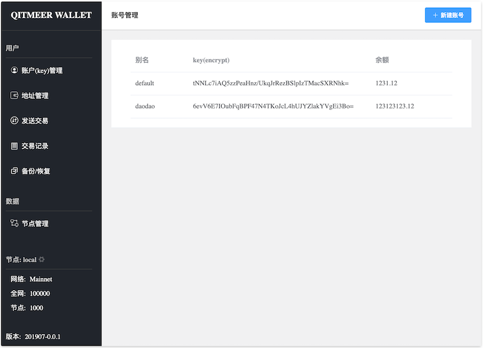

# qitmeer-wallet
The command-line wallet of the Qitmeer network


# download or build

you can download from [relase](https://github.com/HalalChain/qitmeer-wallet/releases)

if you have golang environment, you can build it by yourself

```

git clone https://github.com/HalalChain/qitmeer-wallet.git

cd qitmeer-wallet

go build

```

# useage

There are two ways to use it：RPC interface and Web interface.


## RPC interface

```
# start qitmeer-wallet

./qitmeer-wallet

# default RPC port is 18138

# example

#curl

curl -i -X POST -H 'Content-type':'application/json' --user uid:pwd -d '{"jsonrpc": "2.0","method": "getBalance","params": ["your-address"],"id": 1}' http://127.0.0.1:38130

```

you can also use [qitmeer-cli](https://github.com/HalalChain/qitmeer-cli) to access the qitmeer-wallet RPC interface.

```
./qitmeer-cli getbalance your-address
```

## Web interface

```
# start qitmeer-wallet

./qitmeer-wallet --web

# this will open http://127.0.0.1:38130 in your web browser

```


