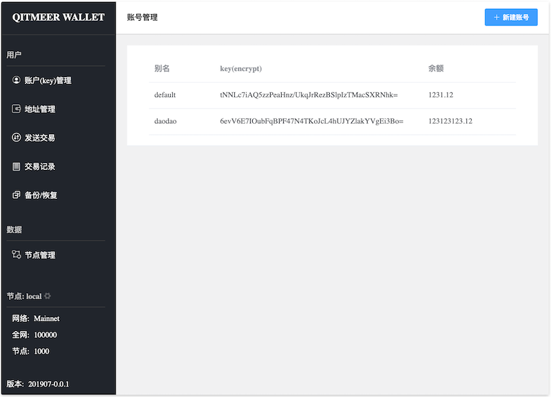

# qitmeer wallet desktop



# build wallet binary

## The first way to build it is by makefile

1. install node 

[https://nodejs.org](https://nodejs.org)

2. install go

[https://golang.org/](https://golang.org/)

3. install statik

 statik is a tool to embed static web files into Go binary 

```sh
go get github.com/rakyll/statik
```

4. build

```sh
make

# rebuild,please clean befaur
# make clean
```


## The second way,build it step by step

1. install base build tools
> node
> install go
> install statik or if you have statik binary

2. build wallet web source (base vue.js)
```sh
cd assets/src && npm install && npm run build
# all web soure will be build to path ./dist
```

3. translate (./dist) web files to go files
```sh 
# if old assets/statik/statik.go file exsit,please delet it .
cd assets && statik -src ./src/dist/
```
all web files merge into statik.go

4. go build 

!!! windows build
recommended use msys2 (http://www.msys2.org/)


# useage

## only use rpc

```sh
# create wallet
./qitmeer-wallet -c config.toml qc create 

# disable UI in you config.toml
# ui=false

# strat rpc
./qitmeer-wallet -c config.toml qc web
```
!!! default rpc url,http://127.0.0.1:8130/api


## use UI wallet
```sh
./qitmeer-wallet -c config.toml qc web
# first start will create wallet account
```